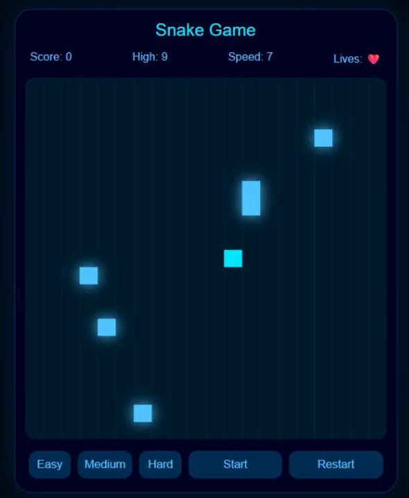

# Internship Tasks Repository

This repository contains the tasks completed during my internship in the domain of **AI & Cyber Security**, focused on strengthening skills in **frontend development, JavaScript logic building, and data visualization techniques**.

The work involves implementing multiple interactive web-based applications using **HTML, CSS, and JavaScript**, developed and tested in **VS Code**.

---

## 🛠 Technologies Used
- HTML5  
- CSS3  
- JavaScript (ES6)  
- Visual Studio Code  

---

## 📁 Project Overview

### 1. 3D Sudoku Puzzle Application
A browser-based Sudoku system designed with an interactive 3D layout.

**Key Features:**
- Dynamic puzzle generation
- Input validation logic
- User interaction handling
- Reset and solve functionality
- 3D visual representation of the grid

---

### 2. Tic Tac Toe Game with AI
An interactive Tic Tac Toe game implemented with basic AI logic.

**Key Features:**
- Player vs Computer mode
- AI-based move decision system
- Win/draw detection logic
- Score tracking system
- Responsive UI updates

---

### 3. Sales Dashboard
A structured analytics dashboard designed to represent business metrics visually.

**Key Features:**
- KPI panel with key business indicators
- Multiple chart components (bar and pie charts)
- Clean grid-based layout
- Static data visualization structure
- Single-screen dashboard design

---

### 4. Population Census Dashboard
An interactive dashboard for visualizing population-related data.

**Key Features:**
- KPI summary panel
- Country-based search functionality
- Dynamic data update on selection
- Multiple chart visualizations
- Structured dashboard layout

---

### 5. Cyber Neon Snake Game
A browser-based arcade-style Snake game with enhanced UI and gameplay mechanics.

**Key Features:**
- Dynamic snake movement system
- Multi-food spawning mechanism
- Difficulty levels (Easy, Medium, Hard)
- Lives system implementation
- Score and high-score tracking
- Game over screen overlay
- Neon-style visual effects

---
## 📸 Project Screenshots

### Population Census

### Tic Tac Toe

### 3D Sudoku

### Sales Dashboard

### Snake Game

## 📌 Execution
Each project is self-contained.  
To run any task, open the respective folder and launch `index.html` in a browser.

---

## 📎 Purpose
The objective of these tasks was to apply and strengthen practical understanding of:
- Frontend development principles  
- JavaScript-based logic implementation  
- UI structuring and interactivity  
- Data visualization fundamentals  

---

## 👤 Author

Shaik Basheer Unnisa 

Domain: AI & Cyber Security  
